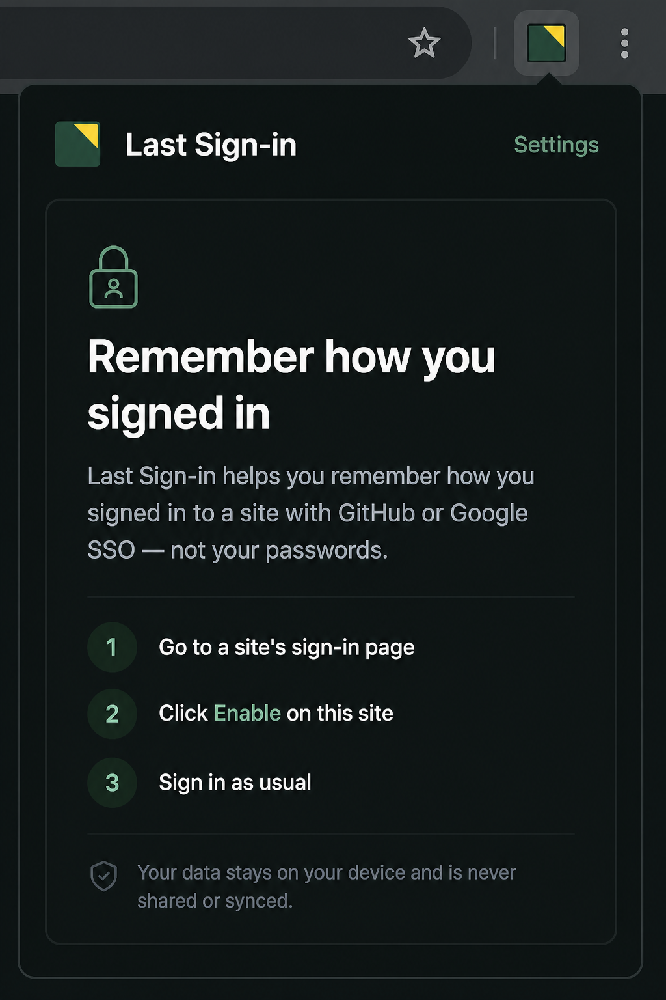
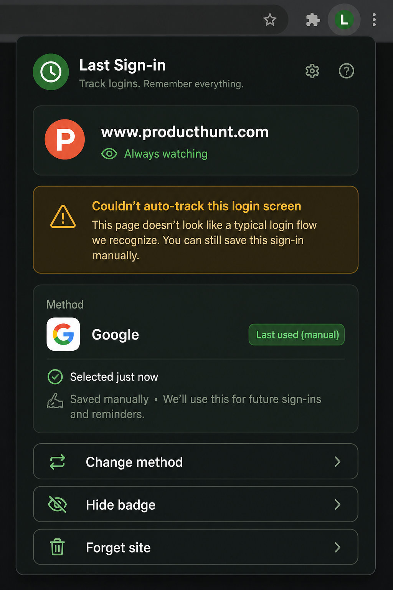
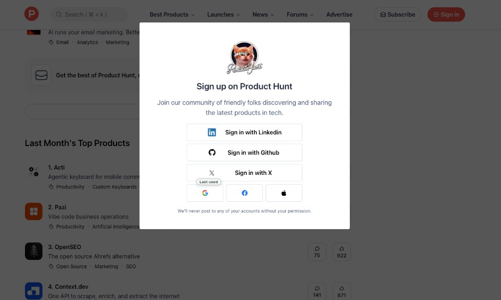
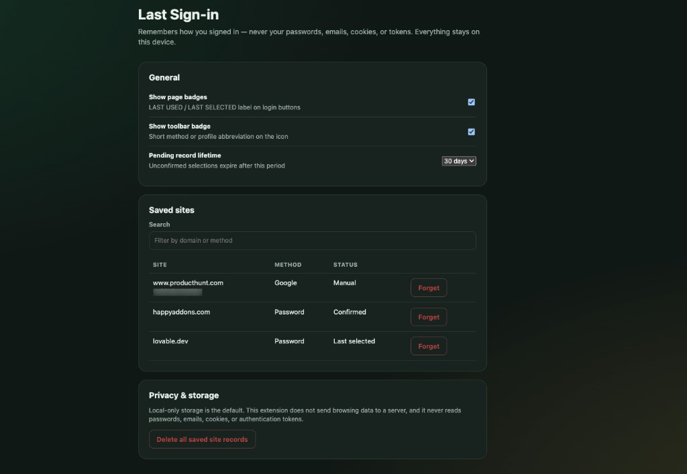

# Last Sign-in

Privacy-first Chrome extension that remembers **how** you signed in on each site — Google, GitHub, SSO, password — and shows a **LAST USED / LAST SELECTED** badge.

It never stores passwords, emails, cookies, or tokens. Everything stays on your device.

**Landing page:** [gtarafdar.github.io/last-sign-in](https://gtarafdar.github.io/last-sign-in/)  
**Download:** [Latest release (zip)](https://github.com/Gtarafdar/last-sign-in/releases/latest)

<p align="center">
  
</p>

<p align="center">
  <a href="https://github.com/Gtarafdar/last-sign-in/releases/latest"></a>
  <a href="LICENSE"></a>
  <a href="docs/privacy.md"></a>
</p>

---

## Why this exists

You open a login screen with eight buttons. Last month it was Google — or GitHub — or work SSO. You guess wrong, bounce through OAuth, and waste another minute. Password managers store secrets; they don’t tell you which **method** you used.

Last Sign-in is a small local memory for method type only.

## Install (easy)

1. Download **`last-sign-in-*-chrome.zip`** from [Releases](https://github.com/Gtarafdar/last-sign-in/releases/latest).
2. Unzip it.
3. Open `chrome://extensions` → turn on **Developer mode**.
4. **Load unpacked** → select the unzipped folder that contains `manifest.json`.

Prefer building from source? See [Develop](#develop) below.

## How to use

1. Open a site’s sign-in page.
2. Click the extension → **Enable on this site**.
3. Sign in as usual — we try to mark that method next time.
4. If auto-detect can’t pin the button (common on icon-only rows like Product Hunt), open the popup → **Save method manually**. Optionally add a **name or email label** as a local reminder — never scraped, never uploaded.

## Manual mode

Some login UIs use icon-only OAuth buttons or custom widgets we can’t pin to reliably. We refuse to scrape credentials to “guess harder.”

| Situation | What to do |
| --- | --- |
| Product Hunt–style icon rows | Save Google (or Apple / Facebook) once via Manual |
| Heavy custom SSO | Manual + optional name/email label |
| Clear “Continue with GitHub” buttons | Auto usually works |

Manual saves show **Last used (manual)** and still remind you next visit.

## Screenshots

| Welcome | Manual fallback | Product Hunt (manual) | Settings |
| --- | --- | --- | --- |
|  |  |  |  |

## Privacy

- Local `chrome.storage.local` only
- No analytics SDK, no Last Sign-in cloud
- Stores: origin, method type, optional reminder label (max 64 chars), timestamps, preferences
- Never stores: passwords, scraped emails, cookies, tokens

Full policy: [docs/privacy.md](docs/privacy.md)

## Honest limitations

- Not every site can be auto-detected (icon-only providers often need Manual)
- Chrome MV3 is the polished line; Firefox packaging exists but isn’t the focus yet
- Per-site enable — nothing runs until you allow that origin
- Badges may use a surface reminder on the login panel when the exact button can’t be pinned

## Develop

Do **not** load the project root in Chrome. Load the built `extension/` folder after build.

```bash
npm install
npm run build
```

Then: `chrome://extensions` → Load unpacked → **`extension/`**.

| Command | Purpose |
| --- | --- |
| `npm run dev` | Dev server with reload |
| `npm run build` | Production build → `.output/chrome-mv3` + sync to `extension/` |
| `npm run test` | Unit tests |
| `npm run check` | Lint + test + build |
| `npm run zip` | WXT zip artifact |

## Stack

Manifest V3 · [WXT](https://wxt.dev) · TypeScript · React · Vitest

## Maker

**Gobinda Tarafdar** — WordPress product marketer · stubborn problem-solver · lifelong Harry Potter devotee.

Product Marketing Specialist at [WPBakery](https://wpbakery.com/). Workshop: [Porter maker page](https://gtarafdar.github.io/porter/#maker).

- [X / Twitter](https://x.com/Gtarafdarr)
- [LinkedIn](https://www.linkedin.com/in/gobinda-tarafdar/)
- [GitHub](https://github.com/Gtarafdar)
- [Donate](https://gtarafdar.com/donate)

If this saves you a wrong OAuth guess: **★ star the repo** — it helps others find it. A tip keeps the workshop lit.

### Also from the workshop

- [Porter](https://gtarafdar.github.io/porter/) — folders between Macs like Finder
- [Aligner](https://gtarafdar.github.io/aligner/) — design / measure / WordPress Chrome toolkit
- [FinderFlow](https://gtarafdar.github.io/FinderFlow/) — Mac file manager + editor
- [Slack Agent Bridge](https://gtarafdar.github.io/slack-agent-bridge/) · [Auto AFK Slack](https://gtarafdar.github.io/auto-afk-slack/) · [Slack Teammate Time](https://gtarafdar.github.io/slack-teammate-local-time/)
- [Broken Link Checker](https://gtarafdar.github.io/broken-link-checker/)
- [Docscriber](https://thedocscriber.com/) · [TheRecaller](https://therecaller.com/) · [TheEditra](https://theeditra.com/) · [The Quill Press](https://thequillpress.com/) · [Costlas](https://costlas.com/)

## License

[MIT](LICENSE) © 2026 Gobinda Tarafdar
