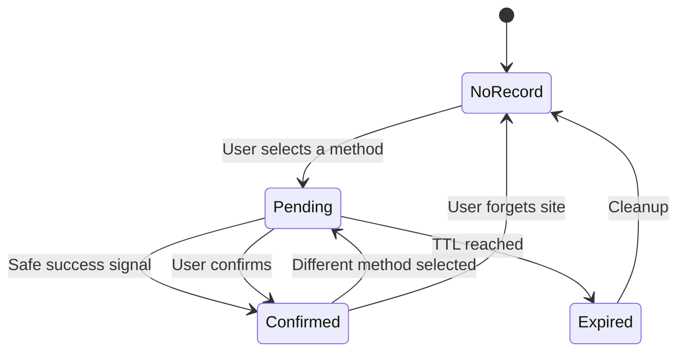

# Last Sign-in

## Product requirements and Cursor build handoff

**Working title:** Last Sign-in  
**Product type:** Privacy-first Chrome extension, Manifest V3  
**Document status:** Build-ready PRD  
**Version:** 1.0  
**Date:** August 2, 2026  
**Primary browser:** Google Chrome desktop  
**Later browser targets:** Microsoft Edge, Brave, other Chromium browsers

> **Product promise:** Remember how I signed in here last time, without remembering my credentials.

## 1. Product summary

Many websites offer several sign-in choices: Google, GitHub, Microsoft, Apple, SSO, email, passkey, or another provider. Returning users often forget which method they used. Choosing the wrong one may create a second account, send them into an error flow, or waste time.

Last Sign-in is a Chrome extension that records the type of sign-in method used for each website. When the user returns to that website's login page, the extension places a small **LAST USED** label beside the matching option. It can also show a short provider or profile label in the Chrome toolbar badge.

The extension must not store passwords, email addresses, usernames, cookies, session tokens, OAuth codes, one-time passwords, passkeys, or form contents.

## 2. Problem statement

### The user problem

Users may have:

- A work account and a personal account.
- Several identity providers across different websites.
- Websites that allow both password and social login.
- Long gaps between visits, making the original choice hard to remember.
- A fear of creating a duplicate account by choosing the wrong provider.

### The current workaround

Users guess, check their password manager, search old emails, or try each provider. A few products show their own “last used” badge, but this behavior is not common and does not follow the user across the web.

### The proposed answer

Keep a small local record that maps a website to a sign-in method and, when requested, a harmless profile label such as **Work** or **Personal**.

Example:

```json
{
  "origin": "https://app.example.com",
  "siteKey": "example.com",
  "methodId": "github",
  "methodLabel": "GitHub",
  "profileLabel": "Work",
  "confidence": "confirmed",
  "lastUsedAt": "2026-08-02T08:30:00.000Z"
}
```

## 3. Goals

### MVP goals

1. Recognize common sign-in methods on web pages.
2. Record the method after a user clicks a likely sign-in control.
3. Distinguish an unconfirmed click from a likely successful sign-in.
4. Show a page-level **LAST USED** label when the same login page is visited again.
5. Show a short toolbar badge for the current website.
6. Let the user correct, label, hide, or delete a saved record.
7. Keep all data on the user's device by default.
8. Request the smallest practical set of browser permissions.
9. Work on single-page apps and pages that add login controls after load.
10. Fail quietly when a website cannot be recognized.

### Later goals

- Optional Chrome Sync, off by default.
- User-created matching rules for unsupported sites.
- Optional “remind me before I choose another method” warning.
- Import and export of non-secret settings.
- Firefox support after the Chrome version is stable.

## 4. Non-goals

The extension will not:

- Log the user into a website.
- Fill email, password, OTP, or identity fields.
- Read or store form values.
- Read browser cookies or authentication headers.
- Store OAuth tokens, session IDs, or passkeys.
- Identify the actual Google, GitHub, Microsoft, or Apple account.
- Promise that a click always means a successful login.
- Send browsing history to a server.
- Track every page the user visits.
- Modify login buttons beyond a small removable label or outline.
- defeat CAPTCHAs, security checks, or website restrictions.

## 5. Target users

### Primary user

A person who regularly switches between work and personal services and uses several login providers.

### Secondary users

- Developers who sign in to many tools with GitHub, Google, and SSO.
- Agency staff who manage separate client and company accounts.
- People who sometimes create duplicate accounts by choosing the wrong method.
- Families using separate browser profiles on a shared device.

## 6. Core user stories

1. As a returning user, I want to see which sign-in method I used last time so I can choose the same one.
2. As a user with work and personal identities, I want to label a saved method without entering my email address.
3. As a privacy-conscious user, I want proof that the extension does not read credentials.
4. As a user, I want to correct the saved method when automatic detection is wrong.
5. As a user, I want to disable the extension on one website.
6. As a user, I want to delete one record or all records.
7. As a user, I want the extension to work when a login form appears inside a modal or loads late.
8. As a user, I want a clear difference between “last clicked” and “last confirmed.”

## 7. Product principles

### Private by design

Store only the minimum record needed to show the reminder. No analytics SDK, ad SDK, remote logging, or external font request in the MVP.

### Honest confidence

Use **Last selected** when only a click is known. Use **Last used** only after a success signal is detected or the user confirms it manually.

### Helpful, never blocking

The page label must not cover, disable, resize, or intercept the website's sign-in control. If placement is unsafe, show the result only in the extension popup.

### Easy correction

Every automated result must be editable. A wrong guess should take no more than two clicks to fix.

## 8. Terminology

| Term | Meaning |
| --- | --- |
| Method | The login route, such as Google, GitHub, SSO, email, or passkey. |
| Profile label | Optional text chosen by the user, such as Work, Personal, Client A, or Admin. |
| Candidate | A page element that may start authentication. |
| Pending record | A method was clicked, but success has not been inferred. |
| Confirmed record | Success was inferred from a redirect or confirmed by the user. |
| Site key | The domain scope used for lookup, normally the registrable domain. |
| Page badge | The small label placed beside a login method on the website. |
| Toolbar badge | The short text shown on the Chrome extension icon. |

## 9. MVP experience

### First run

1. User installs the extension.
2. An onboarding page explains what is and is not stored.
3. The user chooses one permission mode:
   - **Click to activate on a site**, recommended for privacy.
   - **Run automatically on allowed sites**, which uses optional host access.
4. The extension starts with local-only storage and no telemetry.
5. The onboarding page includes a small test card so the user can see a sample badge.

### First recognized sign-in

1. The content script finds likely login controls.
2. The user clicks **Continue with GitHub**.
3. The extension records a pending GitHub choice for that site.
4. If a success signal appears, the record becomes confirmed.
5. If success cannot be inferred, the record stays pending and appears as **Last selected** next time.

### Return visit

1. The login page loads.
2. The extension matches the site to a saved record.
3. It finds the matching control.
4. It adds **LAST USED** or **LAST SELECTED** beside the control.
5. The toolbar badge shows a short label such as `GH`, `G`, `SSO`, `W`, or `P`.

### Manual correction

1. User opens the popup.
2. User chooses **Change method**.
3. User selects a recognized method or enters a custom method name.
4. User may add a profile label.
5. The page badge refreshes without a page reload when possible.

## 10. Login method detection

### Supported built-in methods

- Google
- GitHub
- Microsoft
- Apple
- Facebook
- LinkedIn
- Slack
- SSO
- SAML
- Okta
- Auth0
- Email
- Username and password
- Phone
- Passkey or WebAuthn
- Magic link
- Custom or unknown provider

### Candidate elements

Inspect clickable elements such as:

- `button`
- `a[href]`
- `input[type="submit"]`
- `input[type="button"]`
- `[role="button"]`
- Elements referenced by a label
- Clickable containers with authentication text and a valid interactive descendant

Do not inspect field values. Candidate analysis may read only visible labels and structural attributes needed for matching:

- `innerText` or accessible name
- `aria-label`
- `title`
- `name`
- `id`
- non-secret `data-*` attributes
- destination hostname from `href`, without query parameters
- nearby SVG title or image alt text

### Detection signals

Use a weighted score instead of one fragile selector.

| Signal | Example | Suggested weight |
| --- | --- | ---: |
| Exact accessible label | “Continue with GitHub” | +8 |
| Known provider name | “GitHub” | +5 |
| Authentication verb | sign in, log in, continue, connect | +3 |
| Known OAuth hostname | accounts.google.com | +5 |
| Provider icon label | SVG title “Google” | +3 |
| Element is interactive | button, link, role=button | +2 |
| Password or email field itself | input value or typed content | Reject |
| Sign-up wording only | “Create account with Google” | -4 or ignore by setting |
| Logout wording | “Sign out with…” | Reject |

Default candidate threshold: 7. Put weights and patterns in configuration modules so they can be tested without the DOM.

### Matching rules

Normalize text by lowercasing, trimming whitespace, removing repeated punctuation, and matching Unicode safely. Match phrases, not arbitrary substrings. For example, `apple` should not match `pineapple`.

Prefer this priority:

1. Accessible name and visible text.
2. Known authentication destination hostname.
3. Provider-specific attributes.
4. Nearby icon metadata.
5. User-made rule.

Never infer an identity from an avatar, email text, or account chooser content.

### Dynamic pages

Use a throttled `MutationObserver` to rescan when:

- A login modal opens.
- A route changes inside a single-page app.
- A provider list loads after the initial page.
- A button is replaced during hydration.

Avoid watching the full DOM without throttling. Batch changes and rescan only likely containers. Stop observing or reduce work when the page is hidden.

### Iframes and shadow DOM

- Same-origin iframes may be scanned when permission allows.
- Cross-origin iframe contents must not be bypassed. Show the reminder in the popup if the button cannot be reached.
- Scan open shadow roots when accessible.
- Closed shadow roots are unsupported.

## 11. Recording a selection

Use one capturing click listener at the document level. When a click comes from or passes through a qualified candidate:

1. Resolve the best candidate in the event path.
2. Record method ID, normalized label, origin, site key, timestamp, page-path hint, and confidence `pending`.
3. Do not stop propagation or change navigation.
4. Do not record coordinates, full URLs with queries, or any field content.
5. Mark the record confirmed only through one of the success rules below.

### Success inference

No generic browser extension can know every website's authentication result. The MVP should use conservative signals:

- The authentication page redirects to a different same-site path and a known login form disappears.
- The original tab returns from a known provider domain and a signed-in UI marker appears.
- A site-specific rule defines a safe success selector or path.
- The user chooses **Yes, this worked** from a popup prompt.

Do not inspect cookies, storage belonging to the page, tokens, request bodies, or authorization headers.

If success is unclear, keep confidence as `pending`. Expire pending records after a configurable period, default 30 days, unless the user confirms them.

## 12. Site identity and domain scope

Use the URL origin for the raw record and a registrable-domain site key for normal lookup. Use a maintained Public Suffix List library that can be bundled locally.

Examples:

| Page | Site key | Default scope |
| --- | --- | --- |
| `app.example.com/login` | `example.com` | All subdomains |
| `admin.example.com` | `example.com` | Same record unless user changes scope |
| `example.co.uk` | `example.co.uk` | Correct registrable domain |
| `localhost:3000` | `localhost:3000` | Exact origin |

The popup must let the user switch between:

- This exact origin
- All subdomains of this site

Never collapse unrelated hosted tenants when the registrable domain is a platform. Add an exact-origin default for known multi-tenant hosts and allow user correction.

## 13. Page badge behavior

### Labels

- Confirmed: **LAST USED**
- Pending: **LAST SELECTED**
- Optional profile label: **WORK**, **PERSONAL**, or a user value

### Placement

Preferred order:

1. Inside the candidate's nearest non-interactive wrapper, positioned beside the control.
2. Absolutely positioned relative to a safe wrapper created by the extension.
3. Inline after the control if it does not alter width or wrapping.
4. Popup-only fallback.

The label must:

- Use a high `z-index` only inside its own small area.
- Use `pointer-events: none`.
- Avoid changing the candidate's accessible name.
- Use `aria-hidden="true"` because the popup carries the accessible status.
- Avoid covering provider text, icons, focus rings, or password-manager controls.
- Reposition on resize, scroll, and layout changes using throttled listeners.
- Disappear as soon as the matched control is removed.

### Badge visual style

Use a compact pill with rounded corners, 10 to 11 px semibold text, strong contrast, and a subtle border. Do not copy Supabase's exact colors or styling.

Suggested confirmed palette:

- Text: `#14352A`
- Background: `#BDF4D5`
- Border: `#5ACB94`

Suggested pending palette:

- Text: `#4A3614`
- Background: `#FFF0BF`
- Border: `#E8C65F`

Support light mode, dark mode, Windows high contrast, and `prefers-reduced-motion`.

## 14. Toolbar icon and badge

### Toolbar badge text

Chrome allows only a few readable characters. Use this order:

1. Profile abbreviation if present: `W`, `P`, `ADM`, or the user's custom 1 to 3 characters.
2. Method abbreviation: `G`, `GH`, `MS`, `AP`, `SSO`, `EM`, `PW`, or `PK`.
3. No badge when the site has no record.

Badge background:

- Confirmed: `#166B4A`
- Pending: `#9A6814`
- Disabled: no text

Tooltip examples:

- `Last Sign-in: GitHub, Work, confirmed Aug 2`
- `Last Sign-in: Google, selected but not confirmed`

### Icon creative direction

The icon should feel valuable and recognizable at 16 px. Avoid the common purple-blue AI gradient, glowing orb, sparkle cluster, robot head, or generic shield.

**Concept:** A small doorway or login bracket containing a memory tab. The negative space forms a subtle checkmark. A tiny corner notch suggests a saved marker without resembling a password key.

**Shape rules:**

- One bold silhouette.
- Rounded geometry, but not a plain circle.
- No text inside the icon.
- No thin strokes below 2 px at the 16 px master.
- Keep 2 px optical padding at 16 px.
- Readable in monochrome.
- Do not resemble 1Password, LastPass, Bitwarden, Google, GitHub, or Supabase.

**Palette:**

- Ink: `#152521`
- Main green: `#39C985`
- Warm highlight: `#FFC857`
- Light surface: `#F7F4EC`
- Dark surface: `#101815`

Use a restrained two-color treatment, not a gradient. A very small flat highlight is acceptable. Export PNG files at 16, 32, 48, and 128 px. Keep an SVG source file in `/assets/icon-source.svg`.

**Icon acceptance checks:**

- Recognizable in Chrome's light and dark toolbars.
- Clear at 16 px without blur.
- Still readable when a toolbar badge overlaps the lower-right area.
- Passes a grayscale check.
- Uses original artwork or properly licensed assets.

## 15. Popup design

### Design direction

The popup should look modern and calm, not like the typical AI-tool interface. Avoid purple-to-blue gradients, glassmorphism, glowing blobs, oversized rounded cards, and decorative sparkles.

Use warm off-white surfaces, dark green ink, one fresh green accent, and a small amber state color. Corners can be 10 to 14 px. Shadows should be soft and limited.

### Popup size

- Width: 360 px
- Minimum height: 260 px
- Maximum practical height: 560 px, then scroll inside the content area

### Current-site state

Header:

- Product icon
- `Last Sign-in`
- Small settings button with an accessible label

Site card:

- Favicon or neutral domain mark
- Current domain
- Status: Confirmed, Last selected, No record, Disabled, or Unsupported page

Saved method card:

- Provider icon from bundled, licensed, or original assets
- Method name
- Optional profile label
- Relative date
- Confidence label

Primary actions:

- `Change method`
- `Add profile label` or `Edit label`
- `Confirm this worked` for pending records

Secondary actions:

- `Hide page badge on this site`
- `Forget this site`
- `Disable on this site`

### Empty state

Copy:

> No sign-in method saved for this site yet. Choose a sign-in option and Last Sign-in will remember the method, not your credentials.

Show a `Choose manually` action for pages where detection fails.

### Error state

Copy:

> This page hides its sign-in controls from extensions. You can still save the method manually.

Never claim a website is unsafe simply because it uses an iframe or closed shadow root.

## 16. Settings page

### General

- Show page badges: on by default
- Show toolbar badge: on by default
- Include sign-up buttons: off by default
- Pending record lifetime: 7, 30, 90 days, or never
- Default site scope: registrable domain or exact origin
- Theme: system, light, dark
- Reduce motion: follow system, always, never

### Privacy and storage

- Local-only storage: on and shown as the default
- Chrome Sync: later release, opt-in only
- Export data as JSON
- Import data from JSON with validation and preview
- Delete all saved site records
- Delete all settings and reset extension

### Site management

Searchable list of saved sites with:

- Domain
- Method
- Profile label
- Confidence
- Last-used date
- Scope
- Badge visibility
- Edit and delete actions

### Detection rules

Advanced section, collapsed by default:

- View why a method was detected
- Add a custom text or CSS selector rule for the current site
- Test a custom rule without saving it
- Reset a site's custom rules

Custom selectors must be limited to the saved site and validated before use. Reject selectors that target credential fields or broad page containers.

## 17. Accessibility

- Popup and settings must meet WCAG 2.2 AA where applicable.
- All controls must work by keyboard.
- Visible focus states must not rely on color alone.
- Text contrast must meet 4.5:1 for normal text.
- Status colors must have text labels.
- Minimum popup control target: 36 by 36 px, with 44 px preferred for primary controls.
- Do not add the page badge to the website's tab order.
- Use semantic headings, buttons, lists, labels, and live regions sparingly.
- Announce saved, deleted, and error states in the popup through a polite live region.
- Respect 200% zoom and increased text size.

## 18. Privacy rules

### Allowed storage

- Site origin and site key
- Method ID and display label
- Optional profile label written by the user
- Confidence state
- Timestamps
- Site scope
- Page-badge preference
- User-created matching rule
- Extension settings

### Forbidden collection or storage

- Passwords
- Email addresses or usernames, unless a later feature is separately designed and explicitly accepted by the user
- Phone numbers
- OTP or recovery codes
- Form values
- Cookies
- Local storage or session storage owned by the website
- OAuth authorization codes
- Access or refresh tokens
- Full redirect URLs containing queries or fragments
- Request or response bodies
- Authentication headers
- Keystrokes
- Browsing history unrelated to recognized login pages
- DOM snapshots

### Privacy statement for the UI

> Last Sign-in stores the sign-in method and optional label on your device. It does not read or save passwords, email addresses, cookies, or authentication tokens.

### Data retention

- Confirmed records stay until the user deletes them.
- Pending records expire according to the setting.
- Deleted records must be removed immediately from extension storage.
- Uninstalling the extension follows Chrome's storage behavior. Explain that synced data may behave differently if Chrome Sync is added later.

## 19. Security model

- Use Manifest V3.
- Use no remote code, `eval`, `new Function`, or downloaded scripts.
- Bundle every dependency and asset.
- Set a strict extension Content Security Policy.
- Sanitize all user labels before rendering. Prefer `textContent`, never `innerHTML`.
- Validate imported JSON against a versioned schema.
- Limit custom profile labels to 24 characters and toolbar abbreviations to 3 characters.
- Do not grant content scripts access to extension internals beyond typed messages.
- Validate sender tab and origin in background message handlers.
- Use allowlisted message types and reject unknown payload fields.
- Avoid writing saved data into page DOM attributes.
- Do not expose saved records to website JavaScript.
- Place injected UI in a closed extension-owned shadow root when practical, while keeping removal possible from the content script.
- Strip URL queries and fragments before any URL is saved.
- Add dependency review and `npm audit` to release work, but do not treat a clean audit as the only security check.

## 20. Permissions plan

### Minimum manifest permissions

```json
{
  "permissions": ["storage", "activeTab", "scripting"],
  "optional_host_permissions": ["http://*/*", "https://*/*"]
}
```

Recommended MVP permission approach:

- Use `activeTab` and `scripting` when the user activates the extension for a site.
- Ask for optional host permission only when the user turns on automatic detection for that site or for all sites.
- Do not request `cookies`, `webRequest`, `history`, `tabs`, `identity`, `clipboardRead`, or `clipboardWrite` unless a later approved feature truly needs one.

If automatic all-site behavior is required at launch, explain the host-permission reason in onboarding and the Chrome Web Store listing. Prefer per-site permission to `<all_urls>`.

## 21. Data model

Use TypeScript types and a versioned storage envelope.

```ts
type AuthMethodId =
  | 'google'
  | 'github'
  | 'microsoft'
  | 'apple'
  | 'facebook'
  | 'linkedin'
  | 'slack'
  | 'sso'
  | 'saml'
  | 'okta'
  | 'auth0'
  | 'email'
  | 'password'
  | 'phone'
  | 'passkey'
  | 'magic-link'
  | 'custom';

type Confidence = 'pending' | 'confirmed' | 'manual';
type SiteScope = 'origin' | 'registrable-domain';

interface SiteRecord {
  id: string;
  origin: string;
  siteKey: string;
  scope: SiteScope;
  methodId: AuthMethodId;
  methodLabel: string;
  profileLabel?: string;
  toolbarAbbreviation?: string;
  confidence: Confidence;
  firstRecordedAt: string;
  lastSelectedAt: string;
  lastConfirmedAt?: string;
  pendingExpiresAt?: string;
  loginPathHint?: string;
  pageBadgeHidden: boolean;
  disabled: boolean;
  detectionEvidence?: DetectionEvidenceSummary;
  customRuleIds?: string[];
}

interface DetectionEvidenceSummary {
  version: number;
  methodId: AuthMethodId;
  score: number;
  signalTypes: string[];
}

interface CustomRule {
  id: string;
  siteKey: string;
  type: 'text' | 'selector' | 'success-path' | 'success-selector';
  value: string;
  methodId?: AuthMethodId;
  createdAt: string;
}

interface Settings {
  showPageBadge: boolean;
  showToolbarBadge: boolean;
  includeSignUpButtons: boolean;
  pendingTtlDays: 7 | 30 | 90 | null;
  defaultScope: SiteScope;
  theme: 'system' | 'light' | 'dark';
  motion: 'system' | 'reduce' | 'allow';
  storageMode: 'local';
}

interface StorageEnvelope {
  schemaVersion: 1;
  records: Record<string, SiteRecord>;
  rules: Record<string, CustomRule>;
  settings: Settings;
}
```

Do not store raw candidate text or full detection traces by default. The evidence summary should contain categories, not captured page copy.

## 22. Technical architecture

### Recommended stack

- TypeScript
- React for popup, settings, and onboarding
- Vite with a Manifest V3 extension plugin, or WXT if Cursor can keep the build simple
- Plain CSS variables or CSS Modules
- Vitest for unit tests
- Testing Library for UI tests
- Playwright for extension end-to-end tests
- ESLint and Prettier
- `chrome.storage.local` for MVP storage
- A bundled Public Suffix List parser with a checked license

Do not add a backend for the MVP.

### Main modules

```text
src/
  background/
    service-worker.ts
    messages.ts
    badge-controller.ts
  content/
    index.ts
    candidate-scanner.ts
    candidate-scorer.ts
    click-recorder.ts
    success-observer.ts
    page-badge.ts
    dom-safety.ts
  shared/
    auth-methods.ts
    domain.ts
    storage.ts
    schema.ts
    types.ts
    privacy.ts
  popup/
    App.tsx
    components/
    popup.css
  options/
    App.tsx
    components/
    options.css
  onboarding/
    App.tsx
  assets/
    icon-source.svg
    icon-16.png
    icon-32.png
    icon-48.png
    icon-128.png
tests/
  unit/
  fixtures/
  e2e/
docs/
  privacy.md
  detection-rules.md
```

### Responsibility boundaries

- **Content script:** Read allowed labels and page structure, score candidates, show and remove page badges, record qualified clicks, and report non-secret events.
- **Service worker:** Own storage writes, site lookup, permission checks, toolbar badge state, expiration, and typed message validation.
- **Popup:** Present current-site status and user corrections.
- **Options page:** Manage settings, records, custom rules, import, export, and reset.
- **Shared layer:** Keep types, schemas, method patterns, domain rules, and privacy filters in one place.

### Message types

Use a discriminated union such as:

```ts
type ExtensionMessage =
  | { type: 'CANDIDATES_FOUND'; payload: CandidateSummary[] }
  | { type: 'METHOD_SELECTED'; payload: MethodSelection }
  | { type: 'SUCCESS_SIGNAL'; payload: SuccessSignal }
  | { type: 'GET_CURRENT_SITE_STATE'; payload: { origin: string } }
  | { type: 'UPDATE_SITE_RECORD'; payload: SafeSiteRecordPatch }
  | { type: 'DELETE_SITE_RECORD'; payload: { recordId: string } }
  | { type: 'SET_SITE_PERMISSION'; payload: PermissionChoice };
```

Each handler must validate the payload before acting.

## 23. State flow



Rules:

- A new selection replaces the displayed current method but may retain the prior value only in memory during confirmation. Do not keep an indefinite history in MVP.
- If the new pending choice expires, restore the last confirmed record if one exists.
- Manual corrections use confidence `manual` and may display as **LAST USED** because the user explicitly set them.

## 24. Styling tokens

```css
:root {
  --color-ink: #152521;
  --color-muted: #61706a;
  --color-surface: #f7f4ec;
  --color-card: #fffdf8;
  --color-line: #d9ded8;
  --color-green: #39c985;
  --color-green-dark: #166b4a;
  --color-green-soft: #bdf4d5;
  --color-amber: #ffc857;
  --color-amber-dark: #9a6814;
  --color-danger: #b84040;
  --radius-sm: 8px;
  --radius-md: 12px;
  --radius-lg: 16px;
  --shadow-popup: 0 10px 30px rgba(21, 37, 33, 0.12);
  --focus-ring: 0 0 0 3px rgba(57, 201, 133, 0.32);
}
```

Typography:

- Use a system font stack. Do not fetch web fonts.
- Heading: 16 to 18 px, 650 weight.
- Body: 13 to 14 px.
- Metadata: 11 to 12 px.
- Buttons: 13 px, 600 weight.

Motion:

- 120 to 180 ms for hover and state changes.
- No bouncing, pulsing, or looping animation.
- Remove nonfunctional motion under `prefers-reduced-motion: reduce`.

## 25. Edge cases

The build must cover these cases:

- A site has two Google buttons for sign-in and sign-up.
- A page has both email and password fields plus social providers.
- The provider button contains only an icon with an accessible label.
- A login modal opens after a click.
- The page changes routes without a full reload.
- The selected provider opens a new tab or popup.
- The provider is inside a cross-origin iframe.
- Several buttons match the same provider.
- The website changes button text after hydration.
- The website has a strict CSP.
- The website uses an open or closed shadow root.
- The website already has a “last used” label.
- Browser zoom is 200%.
- Right-to-left page direction.
- Very long translated provider labels.
- A user changes the site's method manually.
- A pending choice fails.
- Two tabs for the same site select different methods.
- Incognito mode is used.
- Chrome storage quota is reached.
- The extension updates its schema.
- A user imports malformed or oversized JSON.
- A website uses `appleid.apple.com`, `login.microsoftonline.com`, or another provider redirect with sensitive query parameters.

For multiple matching controls, mark only the best visible candidate. If scores tie, prefer the candidate closest to a recognized login form. If still tied, do not inject a page badge and show the method in the popup.

## 26. Incognito behavior

Use Chrome's split-incognito behavior if supported. Explain that incognito data is separate and temporary. Do not merge incognito records into normal storage. Do not enable incognito access automatically.

## 27. Localization

MVP interface language may start in English, but all UI strings must live in Chrome `_locales` message files. Detection patterns should be separate from UI copy.

Start detection dictionaries with common authentication words in English. Add languages through reviewed pattern packs rather than machine-translating strings blindly. User-created rules cover unsupported languages in the meantime.

## 28. Performance budget

Targets on a normal login page:

- Initial candidate scan under 20 ms of main-thread work in common cases.
- No continuous polling.
- Mutation scans throttled to at most once every 250 ms during active DOM changes.
- Extension bundle target below 500 KB compressed, excluding required domain data and icons.
- Popup interactive within 150 ms after its script loads.
- Storage lookup should not block the page.

Measure against complex fixtures and at least five live-site layouts during manual testing. Do not ship code that scans every DOM node after every mutation.

## 29. Testing plan

### Unit tests

- Text normalization
- Provider phrase matching
- Word-boundary behavior
- Candidate score calculation
- Rejecting logout and credential fields
- URL stripping
- Registrable-domain calculation
- Pending expiration
- Record replacement and restoration
- Toolbar abbreviation rules
- Import schema validation
- Custom selector validation

### Component tests

- Popup states
- Settings changes
- Confirmation action
- Delete confirmation
- Empty and error states
- Keyboard navigation
- Reduced-motion behavior
- Long labels and translated strings

### DOM fixture tests

Create local fixtures for:

- Standard buttons
- Icon-only buttons
- Nested click targets
- React hydration replacement
- Login modal
- SPA route change
- Open shadow root
- Same-origin iframe
- Multiple candidates
- Existing site badge
- Right-to-left layout

Fixtures must use fake credentials and local pages only.

### End-to-end tests

1. Install unpacked extension in a Chromium test profile.
2. Grant permission to the fixture origin.
3. Click a fake GitHub login option.
4. Simulate a return path and success marker.
5. Revisit the login fixture.
6. Check the page label and toolbar badge.
7. Correct the method in the popup.
8. Disable page injection for the site.
9. Delete the record.
10. Confirm no record remains.

### Privacy tests

- Type fake email and password values, then inspect extension storage. They must not appear.
- Add secrets to URL queries and fragments. Saved URLs must exclude both.
- Scan built bundles for analytics endpoints and remote script references.
- Check that no content-script log prints candidate text or user input in production.
- Check that the website cannot read saved extension data.

### Manual browser matrix

- Latest stable Chrome on Windows
- Latest stable Chrome on macOS
- Chrome at 100%, 125%, and 200% zoom
- Light mode, dark mode, high contrast
- Keyboard-only operation
- At least one low-power computer profile in DevTools

## 30. MVP acceptance criteria

The MVP is ready only when:

- Common provider buttons are detected across the test fixtures.
- Clicking a qualified candidate creates a pending record without reading field content.
- A safe success signal can promote a record to confirmed.
- The return visit shows the correct page label when placement is safe.
- The toolbar badge matches the saved profile or method.
- The popup can edit, confirm, hide, disable, and delete the current-site record.
- The settings page can list and search records.
- Export and import work with schema validation.
- No forbidden data appears in storage, logs, exported JSON, or DOM attributes.
- The extension requests no credential, cookie, history, or network-inspection permission.
- Keyboard, zoom, contrast, and reduced-motion checks pass.
- Unit, component, fixture, and end-to-end tests pass.
- Icons are clear at all required sizes.
- The production build contains no remote code or analytics SDK.
- The unpacked extension loads in Chrome with no manifest or service-worker errors.

## 31. Build phases for Cursor

### Phase 0: Foundation

- Create the Manifest V3 project.
- Add TypeScript, React UI entries, tests, linting, formatting, and build scripts.
- Add typed storage and message schemas.
- Add the privacy guard utilities that strip queries, fragments, and forbidden fields.
- Add fixture pages before detection logic.

**Exit check:** Extension loads unpacked. Popup, options, onboarding, and service worker open without errors.

### Phase 1: Detection engine

- Build text normalization and provider configuration.
- Build candidate scanning and scoring.
- Add click recording.
- Add unit and DOM fixture tests.

**Exit check:** The test suite recognizes common methods and rejects credential inputs, logout controls, and weak matches.

### Phase 2: Storage and current-site state

- Build local storage repository with schema versioning.
- Add site-key and scope rules.
- Add pending TTL and last-confirmed fallback.
- Add toolbar badge controller.

**Exit check:** Selections persist, expire correctly, and update across tabs.

### Phase 3: Page badge

- Build safe placement and removal.
- Add dynamic-page rescanning.
- Add dark, high-contrast, reduced-motion, zoom, and RTL checks.

**Exit check:** The label never blocks or renames a login control across all fixtures.

### Phase 4: Popup and settings

- Build all popup states and actions.
- Build settings, site management, import, export, and reset.
- Add accessible status messages and confirmations for destructive actions.

**Exit check:** A user can understand and correct every saved state without developer tools.

### Phase 5: Success confidence

- Add conservative redirect and UI-marker inference.
- Add manual confirmation.
- Label uncertain results as **Last selected**.

**Exit check:** Failed or unclear login attempts are never presented as confirmed automatically.

### Phase 6: Polish and release

- Draw and export final icons.
- Finish onboarding and privacy copy.
- Run automated and manual tests.
- Prepare Chrome Web Store screenshots, listing copy, privacy disclosure, and support page.

**Exit check:** All acceptance criteria pass from a clean Chrome profile.

## 32. Suggested package scripts

```json
{
  "scripts": {
    "dev": "vite",
    "build": "tsc --noEmit && vite build",
    "lint": "eslint .",
    "format": "prettier --check .",
    "test": "vitest run",
    "test:watch": "vitest",
    "test:e2e": "playwright test",
    "check": "npm run lint && npm run format && npm run test && npm run build"
  }
}
```

Cursor may adjust commands to the chosen extension framework, but the final project must have one `npm run check` command that covers static checks, tests, and production build.

## 33. Definition of done for each code change

A feature is done when:

- The behavior matches this PRD.
- Types and validation cover its input boundaries.
- Tests cover success, failure, and privacy cases.
- UI works by mouse and keyboard.
- No forbidden field is collected or stored.
- The production console stays clean.
- Documentation is updated.
- `npm run check` passes.

## 34. Chrome Web Store preparation

Prepare:

- Extension name and short description.
- 128 px store icon.
- At least three screenshots: page badge, popup current-site state, and privacy/settings screen.
- A privacy policy hosted on a stable public URL.
- A support URL.
- Permission explanations written in plain language.
- A data-use disclosure that matches the shipped code.

Suggested short description:

> See which sign-in method you used last time. Stored on your device, without passwords, emails, cookies, or tokens.

Do not claim that the extension verifies identity or guarantees login success.

## 35. Product metrics without tracking users

Do not add usage analytics to MVP. Product quality can be measured during development through local test results and opt-in tester feedback.

Useful release checks:

- Detection accuracy across the reviewed fixture set.
- False-positive rate.
- Safe page-badge placement rate.
- Number of manual corrections reported by testers.
- Test pass rate across supported Chrome versions.

If telemetry is ever proposed, it requires a separate privacy review, explicit opt-in, a precise event list, retention rules, and a way to use the product fully without telemetry.

## 36. Open decisions before public release

Cursor should build the recommended default where a decision is not answered.

| Decision | Recommended default |
| --- | --- |
| Product name | Use **Last Sign-in** as the working name, then run a trademark and store-name check before release. |
| Permission model | Per-site activation first, optional automatic access. |
| Storage | Local only. |
| Pending label | **LAST SELECTED**. |
| Confirmed label | **LAST USED**. |
| Sign-up detection | Off. |
| Profile label | Optional, user-written, maximum 24 characters. |
| History | Keep current record plus temporary last-confirmed fallback only. |
| Analytics | None. |
| Backend | None. |
| Monetization | Decide after a useful free version is tested. Do not put basic remembering behind payment. |

## 37. Instructions to paste into Cursor

Use this PRD as the source of truth. Build the extension phase by phase. Before writing code, produce:

1. A short architecture decision record naming the framework and why it fits.
2. The proposed file tree.
3. The exact Manifest V3 permissions and the user action that triggers each permission.
4. The storage schema and message union.
5. The Phase 0 and Phase 1 test list.

Then build Phase 0. Run the full check command and fix failures before moving to Phase 1. Continue one phase at a time. Do not remove privacy limits to make detection easier. Do not read form values, cookies, page storage, request bodies, or auth tokens. When the web platform blocks inspection, use a popup-only or manual fallback.

At the end of every phase, report:

- Files added or changed.
- Behavior completed.
- Tests added and results.
- Known limits.
- Next phase.

Do not publish the extension or request broad host access without the owner's approval.

## 38. Final handoff checklist

- [ ] Working name checked against Chrome Web Store and trademarks
- [ ] Manifest V3 project created
- [ ] Minimal and optional permissions implemented
- [ ] Typed storage schema added
- [ ] Provider detection tests passing
- [ ] Credential fields rejected
- [ ] Query and fragment stripping tested
- [ ] Pending and confirmed states working
- [ ] Page badge placement safe
- [ ] Toolbar badge readable
- [ ] Popup complete
- [ ] Settings and site management complete
- [ ] Manual method correction complete
- [ ] Import and export validated
- [ ] Delete and reset flows complete
- [ ] Accessibility checks passed
- [ ] Incognito behavior documented
- [ ] Icons exported at 16, 32, 48, and 128 px
- [ ] No remote code or analytics SDK
- [ ] Privacy policy matches code
- [ ] Full automated test suite passing
- [ ] Manual Chrome matrix completed
- [ ] Store package and screenshots ready
